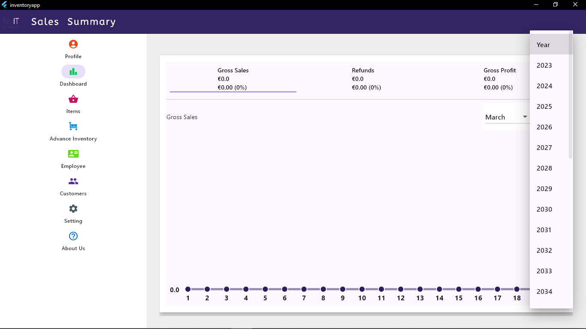
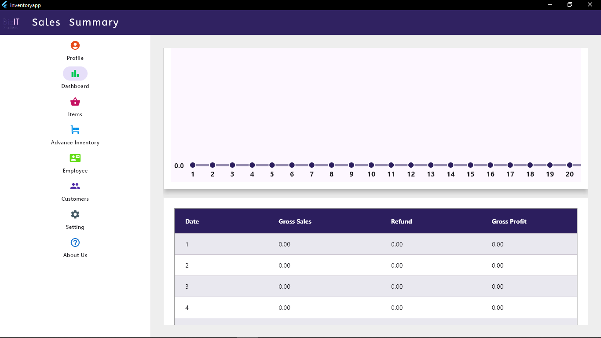
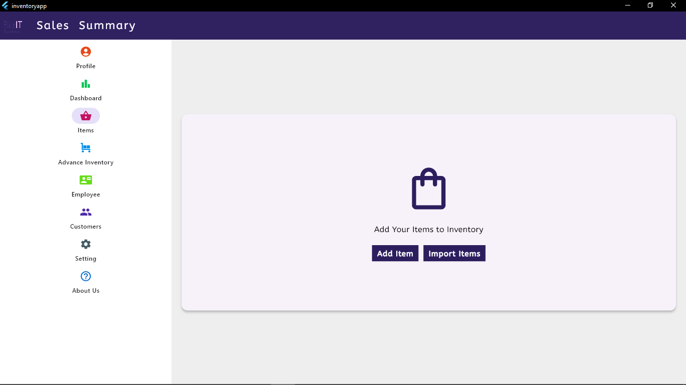
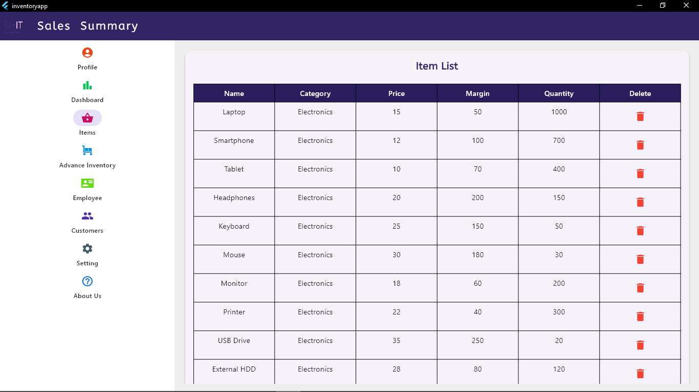
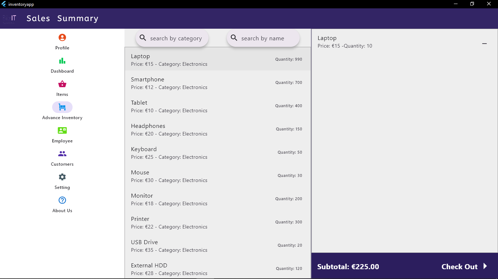
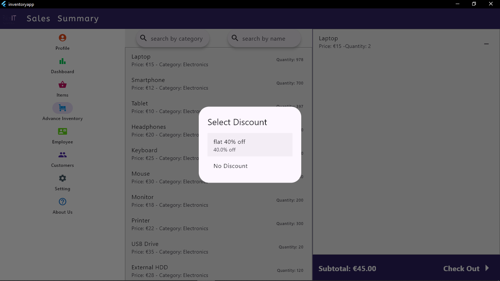
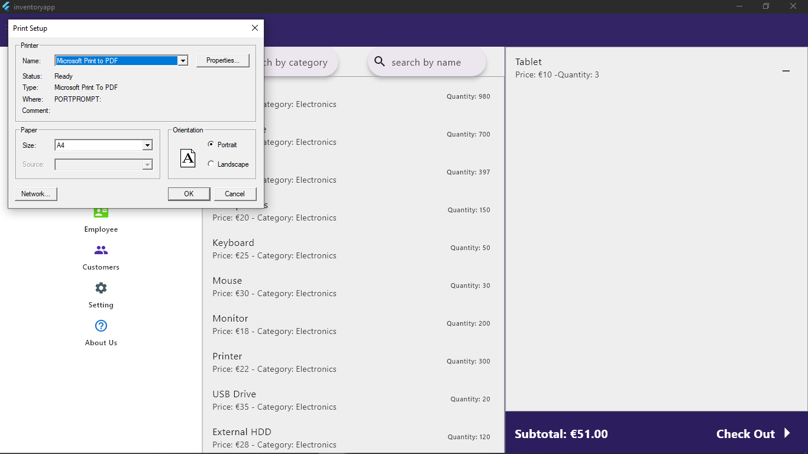
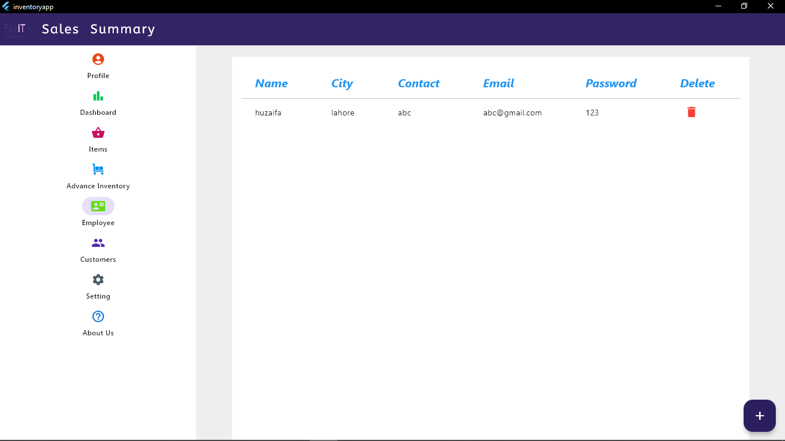
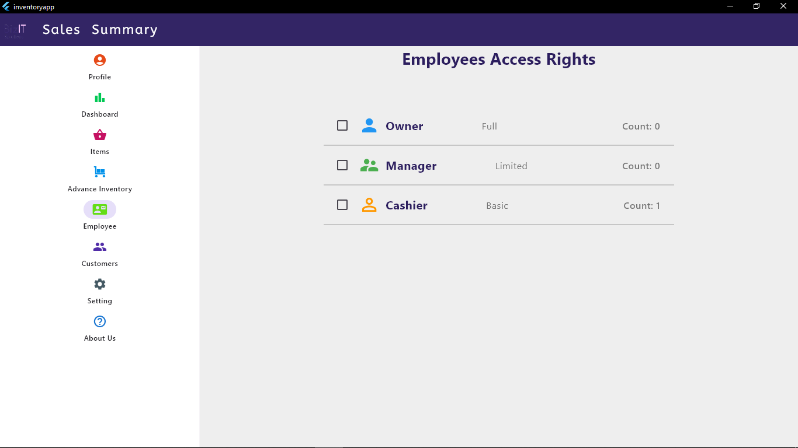
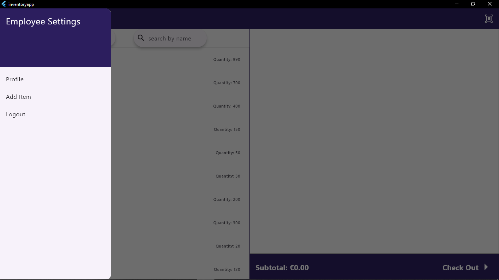

# 📦 Inventory Management System  

A **Flutter Web & Desktop** application for efficient **inventory tracking, sales management, employee management, and reporting**. 🚀  
Designed for **business owners and cashiers** to streamline stock management, sales processing, and customer records.  

---

## 📌 Features  

✅ **Add Products** – Add items manually or bulk upload via **Excel file**.  
✅ **Discount** – add discounts in app and apply discount to sales.  
✅ **Sales Management** – Process sales transactions and generate receipts.  
✅ **Receipt Printing** – Print invoices and sales receipts directly from the app.  
✅ **User Roles** – **Admin (Owner)** & **Cashier View** for controlled access.  
✅ **Sales Reports & Graphs** – View monthly & yearly sales insights with interactive charts.  
✅ **Customer Management** – Maintain a list of customers with purchase history.  
✅ **Data Filtering & Sorting** – Easily filter sales data based on custom date ranges.  

---

## 🏗️ Tech Stack  

### 🖥️ **Frontend**  
- **Flutter**   

### 🗄️ **Backend & Database**  
- **Firebase / SQflite** 

### 📊 **Data Visualization**  
- **fl_chart** – Interactive sales graphs & analytics.  

### 📃 **Other Integrations**  
- **Excel File Processing** – Import bulk product data.  
- **Thermal Printer Support** – Print receipts from the app.  

---

## 📸 Screenshots  

### 🏠 Dashboard (Sales Overview)  



### ➕ Add Product  



### 🛒 POS  



### 🖨️ Receipt Printing  


### 👤 Employee Management  



### 👥 Admin and Employee View


---

## 🚀 How to Run  

1️⃣ **Clone the repo:**  
```bash
git clone https://github.com/YourUsername/Inventory-Management.git
cd Inventory-Management
flutter pub get
flutter run
